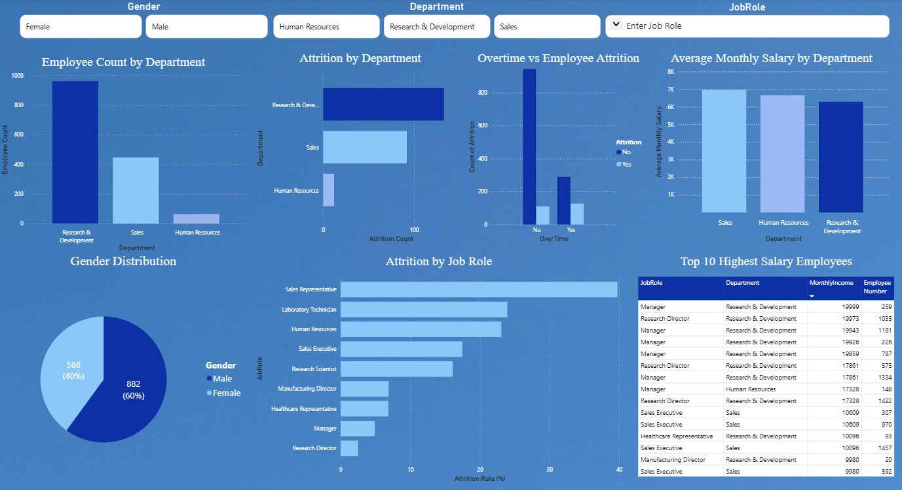

# Employee Workforce & Attrition Analysis

[](SQL/)
[](notebooks/)
[](Power%20BI/)
[](Dataset/)
[]()

An end-to-end People Analytics portfolio project analyzing employee turnover patterns across 1,470 employee records. The analysis connects **relational database queries (MySQL)**, **formal statistical inference & driver modeling (Python)**, and **interactive visual reporting (Power BI)** to evaluate workforce retention patterns and provide structured decision-support findings.

---

## Power BI Dashboard Preview



---

## 1. Project Background & Analytical Objectives

Employee turnover represents a critical operational challenge for organizations, impacting team productivity, onboarding continuity, and institutional knowledge. Using the publicly available IBM HR Analytics benchmark dataset, this project investigates:
1. **Workforce Turnover Baselines**: What are the observed attrition rates across departments, roles, and tenure stages?
2. **Workload & Turnover Association**: Is working overtime statistically associated with higher observed attrition?
3. **Compensation & Tenures**: How do compensation distributions and tenure profiles differ between retained and departed employees?
4. **Multivariable Predictors**: What factors are most strongly associated with turnover odds after adjusting for confounding variables?
5. **Decision Support**: What evidence-based questions and investigations should an HR analytics team pursue next?

---

## 2. Dataset Overview

The analysis uses the **IBM HR Analytics Employee Attrition Dataset** (`WA_Fn-UseC_-HR-Employee-Attrition.csv`), containing **1,470 employee records** and **35 attributes**.

- **Demographics:** Age, Gender, Education, EducationField, MaritalStatus.
- **Employment Attributes:** Department, JobRole, JobLevel, OverTime, BusinessTravel, DistanceFromHome.
- **Tenure Metrics:** YearsAtCompany, YearsInCurrentRole, YearsSinceLastPromotion, YearsWithCurrManager, TotalWorkingYears.
- **Compensation & Performance:** MonthlyIncome, PercentSalaryHike, PerformanceRating, StockOptionLevel.
- **Survey Ratings (1–4 Likert Scales):** JobSatisfaction, EnvironmentSatisfaction, RelationshipSatisfaction, WorkLifeBalance.
- **Data Hygiene Audit:** 0 missing values, 0 duplicate rows. Three constant zero-variance features (`EmployeeCount = 1`, `Over18 = 'Y'`, `StandardHours = 80`) provide zero analytical information and were excluded from statistical modeling.

---

## 3. Tech Stack & Analytical Workflow

```
+------------------+       +-------------------+       +--------------------+       +---------------------+
|   Raw Data       |  -->  |    MySQL Core     |  -->  |  Python Inference  |  -->  |   Power BI & DAX    |
|  (IBM HR 1.47k)  |       |  (CTEs, Windows)  |       |  (SciPy, Statsmod) |       |  (Report & Models)  |
+------------------+       +-------------------+       +--------------------+       +---------------------+
```

| Technology | Role in Project | Applied Concepts |
| :--- | :--- | :--- |
| **MySQL** | Data querying, cohort segmentation & rate calculations | Aggregations, CTEs, Window Functions (`DENSE_RANK`, `RANK`, `ROW_NUMBER`), Multi-dimensional grouping, Conditional filtering (`CASE WHEN`). |
| **Python** | Statistical testing, distribution checks & multivariable modeling | SciPy (`chi2_contingency`, `mannwhitneyu`), Statsmodels (`Logit`), Pandas, NumPy, Seaborn, Matplotlib. |
| **Power BI** | Interactive dashboard & visual reporting | 4-page report, Slicers, Custom Tooltips, Visual Hierarchy. |
| **DAX & Modeling** | Documented analytical architecture & metric specifications | Documented Star Schema architecture and certified DAX KPI formulas (`DIVIDE`, `CALCULATE`, `SUMX`). |

---

## 4. SQL Analysis

The SQL analytical foundation is organized into three scripts located in [`SQL/`](file:///c:/Users/prade/OneDrive/Desktop/Proj/EmployeeWorkforceAnalysis/SQL):

### 4.1 Core Queries ([`Workforce_Analysis.sql`](file:///c:/Users/prade/OneDrive/Desktop/Proj/EmployeeWorkforceAnalysis/SQL/Workforce_Analysis.sql))
- Baseline headcount, attrition counts, and department distributions.
- Gender distribution and cross-gender attrition.
- Department-level average compensation using Common Table Expressions (CTEs).
- Overtime vs. turnover volume breakdowns.

### 4.2 Advanced Queries ([`Workforce_Analysis_Advanced.sql`](file:///c:/Users/prade/OneDrive/Desktop/Proj/EmployeeWorkforceAnalysis/SQL/Workforce_Analysis_Advanced.sql))
- Department-level salary rankings via `DENSE_RANK()`, `RANK()`, and `ROW_NUMBER()`.
- Correlated subqueries identifying staff earning above their departmental average.
- Window functions calculating employee salary delta from the departmental maximum (`MAX(MonthlyIncome) OVER (PARTITION BY Department)`).
- Identification of high-turnover units via `HAVING` filters.

### 4.3 Cohorts & Rate-Based Analysis ([`Workforce_Analysis_Cohorts.sql`](file:///c:/Users/prade/OneDrive/Desktop/Proj/EmployeeWorkforceAnalysis/SQL/Workforce_Analysis_Cohorts.sql))
- **Tenure Cohort Segmentation**: Segmenting tenure into `<1 year`, `1-3 years`, `3-5 years`, and `5+ years`.
- **Cross-Dimensional Rate Analysis**: Department × OverTime interaction, Job Role × OverTime, and Job Level progression.
- **Rate-Based Ranking**: Ranks departments and roles by *attrition percentage* rather than raw headcount to prevent scale bias.

All query outputs are exported and version-controlled as CSV files in [`QueryOutputs/`](file:///c:/Users/prade/OneDrive/Desktop/Proj/EmployeeWorkforceAnalysis/QueryOutputs).

---

## 5. Statistical Analysis & Hypothesis Testing (Python)

All statistical computations are documented and executed in [`notebooks/HR_Workforce_Statistical_Analysis.ipynb`](file:///c:/Users/prade/OneDrive/Desktop/Proj/EmployeeWorkforceAnalysis/notebooks/HR_Workforce_Statistical_Analysis.ipynb).

### 5.1 Hypothesis Test 1: OverTime vs. Attrition (Chi-Square Test)
We tested whether working overtime is statistically associated with employee departure.
- **Null Hypothesis ($H_0$):** Overtime status and employee attrition are independent.
- **Alternative Hypothesis ($H_1$):** Overtime status and employee attrition are significantly associated.
- **Contingency Breakdown:**
  - Standard Hours (No Overtime): 944 stayed, 110 departed (**10.44% observed attrition rate**)
  - Overtime (Works Overtime): 289 stayed, 127 departed (**30.53% observed attrition rate**)
- **Test Results:**
  $$\chi^2 = 87.5643, \quad \text{df} = 1, \quad p = 8.16 \times 10^{-21} \quad (\alpha = 0.05)$$
- **Conclusion:** **Reject $H_0$**. There is a statistically significant association between overtime status and employee attrition in this dataset.

---

### 5.2 Hypothesis Test 2: Salary Comparison across Attrition (Mann-Whitney U Test)
We evaluated whether compensation differed significantly between employees who stayed versus those who departed.
- **Distribution Check:** `MonthlyIncome` exhibited positive skewness (**1.37** for retained, **1.54** for departed), violating normality assumptions for standard Student's t-tests.
- **Test Selection:** The non-parametric **Mann-Whitney U test** was selected as the appropriate test for distribution differences, with Welch's t-test reported as secondary support.
- **Observed Metrics:**
  - Retained Staff: Median = **$5,204** | Mean = **$6,832.74**
  - Departed Staff: Median = **$3,202** | Mean = **$4,787.09**
  - Median Difference: Departing employees had a median income **$2,002 lower (38.47% lower)** than retained peers.
- **Test Results:**
  $$U = 191,600.5, \quad p = 2.95 \times 10^{-14} \quad (\text{Welch's } t = 7.4826, \quad p = 4.43 \times 10^{-13})$$
- **Conclusion:** **Reject $H_0$**. The monthly income distribution of departing employees was significantly lower than that of retained employees.

---

### 5.3 Multivariable Flight Risk Driver Analysis (Logistic Regression)

To assess the association of each factor while adjusting for other variables, a multivariable Logistic Regression model was estimated using `statsmodels.api.Logit`.

- **Model Specification:**
  - **Dependent Variable:** `Attrition` (1 = 'Yes', 0 = 'No').
  - **Independent Variables:** `OverTime_Yes` (binary, reference = 'No'), continuous tenure and income measures (`MonthlyIncome`, `YearsAtCompany`, `YearsInCurrentRole`, `YearsSinceLastPromotion`, `YearsWithCurrManager`), and ordinal survey measures treated linearly (`JobLevel`, `JobSatisfaction`, `EnvironmentSatisfaction`, `WorkLifeBalance`).
  - **Metric Reported:** **Odds Ratio (OR = $\exp(\beta)$)**. An odds ratio reflects the multiplicative change in the *odds* of attrition ($\frac{p}{1-p}$) per one-unit increase in the predictor, holding all other included variables constant. **An odds ratio does not represent a probability or a risk ratio.**

| Predictor Variable | Coefficient ($\beta$) | Odds Ratio ($\exp(\beta)$) | 95% Confidence Interval | p-value | Statistically Defensible Interpretation |
| :--- | :--- | :--- | :--- | :--- | :--- |
| **OverTime (Yes)** | `+1.5250` | **4.60** | `[3.36, 6.29]` | $1.70 \times 10^{-21}$ | After controlling for other model variables, overtime was associated with ~4.6× higher odds of observed attrition vs. non-overtime. |
| **YearsSinceLastPromotion** | `+0.1493` | **1.16** | `[1.08, 1.25]` | $6.29 \times 10^{-5}$ | Holding other variables constant, each additional year since last promotion was associated with ~16% higher odds of attrition. |
| **YearsWithCurrManager** | `-0.1217` | **0.89** | `[0.82, 0.96]` | $2.93 \times 10^{-3}$ | Holding other variables constant, each additional year with the current manager was associated with ~11% lower odds of attrition. |
| **YearsInCurrentRole** | `-0.1251` | **0.88** | `[0.82, 0.96]` | $1.98 \times 10^{-3}$ | Holding other variables constant, each additional year in role was associated with ~12% lower odds of attrition. |
| **JobSatisfaction** | `-0.3177` | **0.73** | `[0.63, 0.84]` | $6.38 \times 10^{-6}$ | Each 1-point increase in job satisfaction was associated with ~27% lower odds of attrition, holding other variables constant. |
| **EnvironmentSatisfaction** | `-0.3587` | **0.70** | `[0.61, 0.80]` | $6.00 \times 10^{-7}$ | Each 1-point increase in environment satisfaction was associated with ~30% lower odds of attrition, holding other variables constant. |

> **Observational Data Limitation:**  
> These statistical associations highlight empirical risk factors in this dataset but **do not establish direct causality**. Unmeasured variables (such as team workload, leadership practices, or external market opportunities) may influence both employee satisfaction, hours, and turnover.

---

## 6. Power BI Dashboard & Data Modeling

The Power BI reporting layer ([`Employee_Workforce_Analysis.pbix`](file:///c:/Users/prade/OneDrive/Desktop/Proj/EmployeeWorkforceAnalysis/Power%20BI/Employee_Workforce_Analysis.pbix)) provides visual reporting across workforce segments:

### Data Model Architecture
- **Current File Implementation:** The existing Power BI file utilizes a single flat table (`employee`) containing the imported dataset attributes.
- **Proposed Dimensional Architecture:** In [`DAX/Data_Model_Architecture.md`](file:///c:/Users/prade/OneDrive/Desktop/Proj/EmployeeWorkforceAnalysis/DAX/Data_Model_Architecture.md), a normalized **Star Schema** is documented to illustrate how the flat dataset could be structured into `Fact_Employee` and dimension tables (`Dim_Department`, `Dim_JobRole`, `Dim_Demographics`, `Dim_Satisfaction`) for scalable enterprise deployment.

### DAX Measures Specification
- **Current File Implementation:** Includes core calculations such as the baseline `Attrition Rate`.
- **Documented DAX Catalog:** In [`DAX/DAX_Measures.md`](file:///c:/Users/prade/OneDrive/Desktop/Proj/EmployeeWorkforceAnalysis/DAX/DAX_Measures.md), standardized DAX expressions (`Total Employees`, `Attrition Count`, `Overtime Attrition Rate`, `Non-Overtime Attrition Rate`, `Avg Monthly Income`, `Avg Tenure`) are documented with syntax and business context.

---

## 7. Key Findings (Structured Evidence Framework)

### Finding 1: Overtime Association with Turnover
- **Finding:** Employees working overtime exhibited a significantly higher attrition rate than employees on standard hours.
- **Evidence:** Overtime employees had an observed attrition rate of **30.53%** (127 of 416) compared to **10.44%** (110 of 1,054) for non-overtime peers. Chi-Square test: $\chi^2 = 87.5643, p = 8.16 \times 10^{-21}$. Logistic regression adjusted odds ratio: $\text{OR} = 4.60$ ($p < 0.001$).
- **Interpretation:** Overtime is strongly associated with employee departures across all departments in this dataset.
- **Limitation:** The observational data does not prove that overtime directly causes departures; overtime may coincide with high-stress assignments or understaffed teams.
- **Recommended Investigation:** An organization could audit overtime distribution across departments to evaluate whether workloads are structural or seasonal.

### Finding 2: Higher Early-Tenure Attrition
- **Finding:** Observed turnover is concentrated among employees in their first few years at the company.
- **Evidence:** Employees with `<1 year` of company tenure had an observed attrition rate of **36.36%** (16 of 44); employees with `1-3 years` had an attrition rate of **24.88%** (106 of 426). In total, employees with $\le 3$ years of tenure accounted for **51.48% (122 of 237)** of all departures in the dataset. Staff with `5+ years` had an attrition rate of **10.81%** (75 of 694).
- **Interpretation:** Early-tenure employees exhibit higher flight rates, after which attrition rates stabilize.
- **Limitation:** Tenure is recorded as completed years in a cross-sectional snapshot; exit reasons (voluntary vs. involuntary termination) are not separated.
- **Recommended Investigation:** Review onboarding experiences, first-year role clarity, and early milestone feedback.

### Finding 3: Role-Level Turnover Disparity
- **Finding:** Attrition rates vary substantially across functional job roles.
- **Evidence:** **Sales Representatives** showed the highest observed attrition rate at **39.76%** (33 of 83), followed by **Laboratory Technicians at 23.94%** (62 of 259) and **Human Resources staff at 23.08%** (12 of 52). By contrast, Research Directors had an observed attrition rate of **2.50%** (2 of 80).
- **Interpretation:** Field sales and laboratory operational roles display substantially higher turnover in this organization.
- **Limitation:** Dataset does not record specific market compensation benchmarks or sales commission structures.
- **Recommended Investigation:** Investigate role-specific compensation equity, sales targets, and career advancement pathways for laboratory staff.

### Finding 4: Promotion Timing Association
- **Finding:** Longer intervals without promotion are associated with higher turnover odds.
- **Evidence:** In the multivariable logistic regression, each additional year since the last promotion was associated with approximately **16% higher odds of attrition** ($\text{OR} = 1.161, 95\%\text{ CI: }[1.08, 1.25], p = 6.29 \times 10^{-5}$), holding other variables constant.
- **Interpretation:** Extended periods in a single grade or title without advancement may correlate with reduced retention.
- **Limitation:** The model cannot differentiate between high-performing employees leaving due to lack of promotion versus low-performing employees remaining unpromoted.
- **Recommended Investigation:** Evaluate internal promotion cadence and lateral career progression opportunities.

### Finding 5: Compensation Differences Across Attrition Status
- **Finding:** Departing employees had lower monthly incomes than retained employees.
- **Evidence:** Retained employees had a median monthly income of **$5,204** (mean: $6,832.74), while departing employees had a median of **$3,202** (mean: $4,787.09), a median difference of **$2,002 (38.47% lower)**. Mann-Whitney $U = 191,600.5, p = 2.95 \times 10^{-14}$.
- **Interpretation:** Lower-compensation cohorts experience higher relative turnover in this dataset.
- **Limitation:** Compensation is strongly correlated with job level and tenure; lower pay often reflects junior roles where baseline turnover is naturally higher.
- **Recommended Investigation:** Conduct compensation parity reviews within job levels to determine if pay compression exists.

---

## 8. Analytical Recommendations for Decision Support

1. **Workload and Overtime Review**:
   - Audit teams with consistent overtime hours (particularly in Sales and Laboratory roles) to distinguish chronic staffing shortages from short-term project demands.
2. **Early-Tenure Onboarding Focus**:
   - Because over half of observed departures occurred among employees with $\le 3$ years of tenure, evaluate structured check-ins at 30, 60, and 90 days.
3. **Internal Career Progression Checkpoints**:
   - Given the association between promotion timing and turnover odds, establish regular progression reviews for employees reaching 2+ years without a title or grade change.
4. **Analytical Turnover-Cost Scenario Modeling (Optional)**:
   - In [`DAX/DAX_Measures.md`](file:///c:/Users/prade/OneDrive/Desktop/Proj/EmployeeWorkforceAnalysis/DAX/DAX_Measures.md), an illustrative scenario estimate ($6.81M) is documented based on an assumed 50% replacement-cost factor. Organizations can apply their own specific replacement-cost figures to translate retention changes into cost estimates.

---

## 9. Project Directory Structure

```
EmployeeWorkforceAnalysis/
|-- Dataset/
|   `-- WA_Fn-UseC_-HR-Employee-Attrition.csv      # IBM HR Benchmark Dataset (1,470 rows)
|-- SQL/
|   |-- Workforce_Analysis.sql                    # Core aggregations, CTEs, basic queries
|   |-- Workforce_Analysis_Advanced.sql           # Subqueries, window functions, rankings
|   `-- Workforce_Analysis_Cohorts.sql            # Tenure cohorts, cross-rates & rankings
|-- notebooks/
|   `-- HR_Workforce_Statistical_Analysis.ipynb   # Executed Jupyter Notebook (EDA & Stats)
|-- DAX/
|   |-- DAX_Measures.md                           # Documented DAX expressions & formulas
|   `-- Data_Model_Architecture.md                # Proposed Star Schema design specification
|-- Power BI/
|   `-- Employee_Workforce_Analysis.pbix          # Interactive Power BI report file
|-- QueryOutputs/                                 # 30 CSV outputs of verified SQL queries
|-- Screenshots/                                  # High-resolution dashboard image assets
`-- README.md                                     # Project portfolio documentation
```

---

## 10. How to Run & Reproduce

### 1. SQL Analysis
1. Load `Dataset/WA_Fn-UseC_-HR-Employee-Attrition.csv` into a MySQL database named `employee_workforce_analysis` as table `employee`.
2. Run SQL scripts in sequence:
   - `SQL/Workforce_Analysis.sql`
   - `SQL/Workforce_Analysis_Advanced.sql`
   - `SQL/Workforce_Analysis_Cohorts.sql`

### 2. Python Statistical Analysis
1. Install standard analytical dependencies:
   ```bash
   pip install pandas numpy scipy matplotlib seaborn statsmodels jupyter
   ```
2. Open and run the notebook:
   ```bash
   jupyter notebook notebooks/HR_Workforce_Statistical_Analysis.ipynb
   ```

### 3. Power BI Dashboard
1. Open [`Power BI/Employee_Workforce_Analysis.pbix`](file:///c:/Users/prade/OneDrive/Desktop/Proj/EmployeeWorkforceAnalysis/Power%20BI/Employee_Workforce_Analysis.pbix) in **Power BI Desktop**.
2. Refresh data source pointing to `Dataset/WA_Fn-UseC_-HR-Employee-Attrition.csv` if prompted.

---

## 11. Resume Highlights (Verified & Implementation-Backed)

These three concise bullet points are 100% verified against the actual implemented files:

- **Workforce Analytics (MySQL):** *Analyzed turnover patterns across 1,470 employee records using MySQL (CTEs, Window Functions, and aggregations), evaluating department-level distributions and identifying a 30.5% attrition rate among overtime workers vs. 10.4% for standard-hours peers.*
- **Statistical Inference & Driver Modeling (Python):** *Performed hypothesis testing in Python using Chi-Square independence tests ($\chi^2 = 87.56, p < 0.001$), Mann-Whitney U tests on compensation ($p < 0.001$), and multivariable logistic regression to quantify adjusted odds ratios for turnover factors.*
- **BI Reporting & Metric Design (Power BI):** *Built an interactive multi-page Power BI dashboard visualizing workforce demographics and turnover distributions, while documenting proposed dimensional model architecture and standard DAX KPI formulas.*
